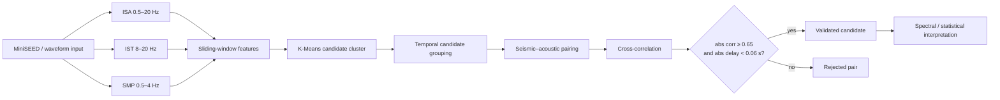

# Volcano Seismo-Acoustic Explosion Detection

[](https://github.com/jlmendez/volcano-seismoacoustic-detection/actions/workflows/ci.yml)

A signal-processing and clustering workflow for detecting and validating volcanic explosions using seismic and acoustic/infrasound records from **Volcán de Fuego, Guatemala**.

## Research pipeline



## Methodological depth

- waveform ingestion and handling with ObsPy;
- channel-specific Butterworth filtering;
- RMS, peak amplitude, energy, kurtosis and skewness extraction;
- K-Means segmentation of energetic windows;
- short-gap temporal merging of candidate detections;
- normalized seismic/acoustic cross-correlation;
- explicit delay constraint for coupling validation;
- FFT/STFT helpers for spectral interpretation;
- separation between reusable modules and a synthetic demonstration notebook.

## Validation logic

The coupling layer is intentionally testable without access to institutional waveform data.

| Condition | Interpretation |
|---|---|
| `abs(correlation) >= 0.65` | sufficiently similar waveform pair |
| `abs(delay) < 0.06 s` | near-synchronous seismic/acoustic response |
| zero-energy signals | rejected safely with zero correlation |
| identical non-constant signals | correlation near `1.0`, delay near `0 s` |

## Repository structure

```text
.
├── data/external/
│   └── README.md
├── notebooks/
│   ├── README.md
│   └── seismoacoustic_pipeline_demo.ipynb
├── src/
│   ├── clustering.py
│   ├── features.py
│   ├── filters.py
│   ├── seismoacoustic_detection.py
│   ├── spectra.py
│   └── validation.py
├── tests/
│   └── test_validation.py
├── .github/workflows/
│   └── ci.yml
└── requirements.txt
```

## Reproducibility

Waveform and catalogue files are intentionally not redistributed. Authorized data can be placed under `data/external/`. The notebook uses synthetic coupled events so the processing logic remains inspectable without exposing restricted observations.

```bash
python -m venv .venv
# Windows: .venv\Scripts\activate
# Linux/macOS: source .venv/bin/activate
pip install -r requirements.txt
pip install pytest
pytest -q
```

## Research context

This repository distills a larger seismo-acoustic research workflow into reusable components suitable for inspection, extension and eventual integration into monitoring pipelines. It is designed to show both the **scientific reasoning** and the **software structure** behind the detection method.
